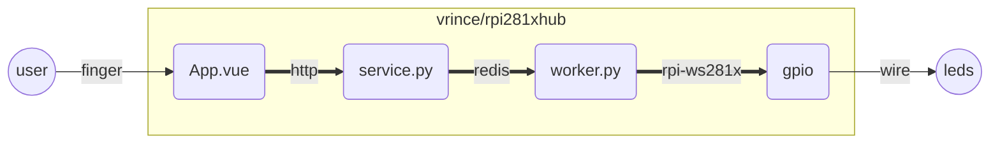

# RPi WS281x Hub

This project is meant to manage `ws281x` leds on the RPi. It's compose of 3 parts, a web app (`vuejs`), a web services (`python flask`) that dispatch ascronous led tasks to a worker (`celery worker`). Celery queue is serve by redis (`docker arm32v7/redis`). 



github user you can go gitlab enjoy the graph ...

This is tested on the RPi3 with a adafruits neopixels.

## Installing

## Using

## Developing

Most users should simply run:

```bash
sudo pip3 install rpi_ws281x colour flask flask-cors celery redis 
```

## Sync to pi

```
./sync
```

run with same ssh

## Redis in docker

https://thisdavej.com/how-to-install-redis-on-a-raspberry-pi-using-docker/#option-1---create-redis-server-for-localhost-requests-only

```bash
curl -fsSL get.docker.com -o get-docker.sh && sh get-docker.sh
sudo usermod -aG docker pi
newgrp docker
docker run --name redis -d -p 6379:6379 --restart unless-stopped arm32v7/redis --appendonly yes --maxmemory 512mb --tcp-backlog 128
```

## Development

Deploy code on the pi (auto synchronize in develoment : keep locel file deployed to the pi al long as the script is running).

```bash
./sync
```

### Run the `service`

Flask service that serve generic celery task dispatcher on port `5000` **and** the static build of the vue app. **This script auto reload the service when `service.py` change**.

**Warning: On the pi !**

```bash
ssh pi@<ip>
cd leds/
./run-service.sh
```

Open http://pi-IP:5000/queue to see the current worker queue.

### Run worker `worker`

Worker need to be run as root ta access the hardware. **This script auto reload the celery worker when `worker.py` change or crash**.

**Warning: On the pi !**

```bash
ssh pi@<ip>
cd leds/
sudo ./run-worker.sh
```

### Run the `vuejs webapp`

#### Run locally

```bash
cd rpi-ws281x-vue
yarn serve
```

open http://localhost:8080

#### Run on the pi

Make sure the `sync.sh` script is running, the build result will be generated locaaly then sync to the `pi` then serve by the flask app.

```bash
yarn build
```