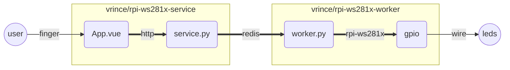

# RPi WS281x Hub

This project is meant to manage `ws281x` leds on the RPi. It's compose of 3 parts, a web app (`vuejs`), a web services (`python flask`) that dispatch ascronous led tasks to a worker (`celery worker`). Celery queue is serve by redis (`docker arm32v7/redis`). All that microservice style using containerized application. 



github user you can go gitlab enjoy the graph ...

This is tested on the RPi3 with a adafruits neopixels.

All of it is overkill for what is does.

## Installing

On the pi run the following commands.

### Docker & docker-compose

```bash
curl -fsSL get.docker.com -o get-docker.sh && sh get-docker.sh
sudo usermod -aG docker pi
newgrp docker
sudo pip3 install docker-compose
```

### The stack

Then enjoy the docker / docker-compose power.

```bash
wget 
docker-compose up -d
```

:tada: you shoul be able to open http://<pi-ip>:5000 and send leds commands.

To see logs while running.

```bash
docker-compose logs -f
```

To stop the thing.

```bash
docker-compose stop
```

## Developing

## Sync to pi

This will continously push the code to the pi as you change it on your computer.

```
git clone https://github.com/vrince/rpi-ws281x-hub.git
cat ~/.ssh/pi_id_rsa.pub | ssh pi@<pi-ip> "mkdir -p ~/.ssh && chmod 700 ~/.ssh && cat >>  ~/.ssh/authorized_keys"
./sync <pi-ip>
```

## On the pi

```bash
ssh pi@<pi-ip>
```

### Dependencies

```bash
sudo pip3 install rpi_ws281x colour flask flask-cors celery redis 
```

### Redis in docker

https://thisdavej.com/how-to-install-redis-on-a-raspberry-pi-using-docker/#option-1---create-redis-server-for-localhost-requests-only

```bash
curl -fsSL get.docker.com -o get-docker.sh && sh get-docker.sh
sudo usermod -aG docker pi
newgrp docker
docker run --name redis -d -p 6379:6379 --restart unless-stopped arm32v7/redis --appendonly yes --maxmemory 512mb --tcp-backlog 128
```

### Run the `service`

Flask service that serve generic celery task dispatcher on port `5000` **and** the static build of the vue app. **This script auto reload the service when `service.py` change**.

```bash
ssh pi@<ip>
cd rpi-ws281x-hub
./run-service.sh
```

Open http://<pi-ip>:5000/queue to see the current worker queue.

### Run worker `worker`

Worker need to be run as root ta access the hardware. **This script auto reload the celery worker when `worker.py` change or crash**.

```bash
ssh pi@<ip>
cd rpi-ws281x-hub
sudo ./run-worker.sh
```

### Run the `vuejs webapp`

#### Run locally

**!! this is on your computer not on the pi !!**

```bash
cd rpi-ws281x-vue
VUE_APP_BASE_URL="http://<pi-ip>:5000" yarn serve
```

open http://localhost:8080

#### Deploy weeb app on the pi

Make sure the `sync.sh` script is running, the build result will be generated locaaly then sync to the `pi` then serve by the flask app.

```bash
yarn build
```

### Docker

Fo those a litle familiar with docker you'll be able to build docker images simply.

## Credits

### RPi-ws281x-python ([source](https://github.com/rpi-ws281x/rpi-ws281x-python))

At the very beging it was a fork of RPi-ws281x-python, I basically hack the `SK6812_strandtest.py` file to make the `worker.py` credit goes to [Gadgetoid](https://github.com/Gadgetoid) !

### Redis on docker ([source](https://thisdavej.com/how-to-install-redis-on-a-raspberry-pi-using-docker/#option-1---create-redis-server-for-localhost-requests-only))